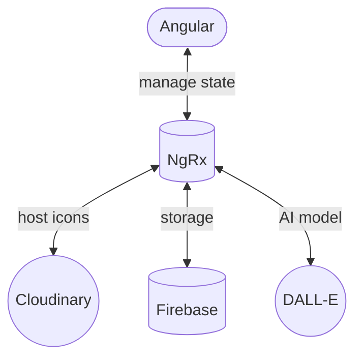
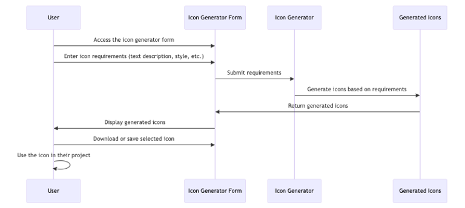

# IconGenerator ⭐️

Technologies:

- Stack: Angular, NgRx, Firebase
- UI Library: Angular Material, PrimeNG
- Services: Stripe, Cloudinary, DALL-E

## Project Structure ⚙️



## Additional Libraries

- Ngx Stipe (simplify Stripe integration)
- Ngx-env/builder (use .env variables)

## Main idea of the project

Project:

- simplify the steps needed to generate icon
- automate icon generation process
- store generated icons and their inputs in one place

**Creating icon without icon generator**

**Creating icon with icon generator**


## Sequence diagrams of creating an icon



## Conclusion

Completed tasks:

- [Known] Integrate DALL-E API
- [Known] Implement website UI using Angular
  - [Known] Use Firebase as storage
- [Known] Use Cloudinary as image hosting service
- [Known] Integrate Stripe payment system
  - [Known] Implement authentication via Google
- [New] Implement prompt engineering logic for icon generation
- [New] Implement parameters needed for icon generation

Benefits of the project:

- Pay as you generate
- Icon generation automation
- Saved icons and their parameters in one place
- Converted to .ico format

## How to run

Locally:

```
ng serve OR npm start
```

Docker:

```
docker build -t icon-generator .
docker run -d -p 8080:80 --name icon-generator-container icon-generator
```

_Stripe works only with netlify functions_
